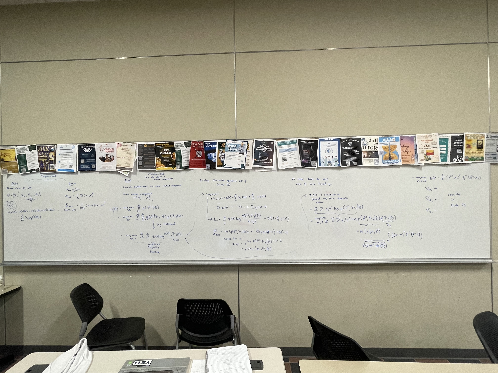

<!--  -->

This is a compilation of content pertaining to academia through my tenure as an undergraduate at The University of Texas at Dallas pursuing Computer Science.

<!-- [[Course Reviews]] \
[[Resources]] \
[[Projects]]  -->

I created this website using Quartz, which I highly recommend. If this website grows or I decide to centralize all of my websites to one, I will switch to Hugo.